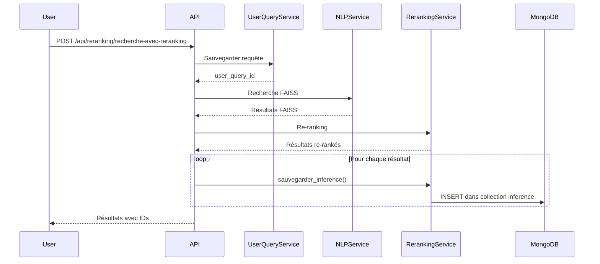
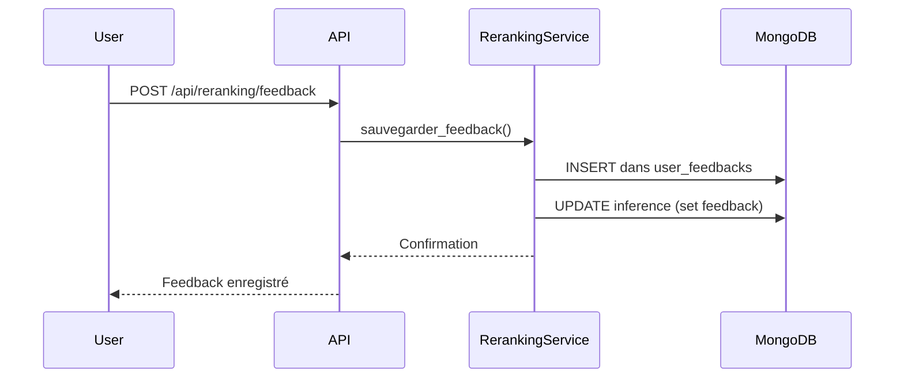

# 📊 Système de Tracking des Inférences

## Vue d'ensemble

Le système d'inférence permet de tracer toutes les recommandations faites par le système de re-ranking. Chaque fois qu'une recherche est effectuée, les résultats recommandés sont enregistrés dans une collection MongoDB `inference` avec leurs scores et peuvent être mis à jour avec les feedbacks utilisateurs.

## 🗄️ Structure de la Collection `inference`

Chaque document dans la collection `inference` représente une recommandation (inférence) faite par le système :

```json
{
  "_id": "ObjectId",
  "user_query_id": "507f1f77bcf86cd799439011",
  "resource_id": "507f1f77bcf86cd799439012",
  "faiss_score": 0.85,
  "reranking_score": 0.92,
  "final_score": 0.89,
  "rank": 1,
  "feedback": null,
  "date_inference": "2024-12-08T10:30:00",
  "session_id": "session_123",
  "date_feedback": null,
  "metadata": {}
}
```

### Champs principaux

| Champ | Type | Description |
|-------|------|-------------|
| `user_query_id` | String | ID de la requête utilisateur (référence à `users_queries`) |
| `resource_id` | String | ID de la ressource recommandée (référence à `ressources_educatives`) |
| `faiss_score` | Float | Score de similarité FAISS (0-1) |
| `reranking_score` | Float (nullable) | Score du cross-encoder (peut être null si re-ranking désactivé) |
| `final_score` | Float | Score final combiné utilisé pour le classement |
| `rank` | Integer | Position de la ressource dans le classement (1 = meilleur) |
| `feedback` | String (nullable) | Feedback utilisateur : "like", "dislike", "click", "view" ou null |
| `date_inference` | DateTime | Date/heure de la recommandation |
| `date_feedback` | DateTime (nullable) | Date/heure du feedback (si donné) |
| `session_id` | String (nullable) | Identifiant de session utilisateur |

## 🔄 Flux de données

### 1. Création d'inférences (lors d'une recherche)



### 2. Mise à jour avec feedback utilisateur



## 📡 Endpoints API

### 1. Recherche avec tracking automatique

**POST** `/api/reranking/recherche-avec-reranking`

```json
{
  "question": "machine learning pour débutants",
  "top_k_faiss": 50,
  "top_k_final": 10,
  "use_reranker": true,
  "session_id": "session_123"
}
```

→ Crée automatiquement des inférences pour chaque résultat retourné

### 2. Soumettre un feedback

**POST** `/api/reranking/feedback`

```json
{
  "user_query_id": "507f1f77bcf86cd799439011",
  "resource_id": "507f1f77bcf86cd799439012",
  "query_text": "machine learning tutoriel",
  "resource_title": "Introduction au Machine Learning",
  "feedback_type": "like",
  "session_id": "session_123"
}
```

→ Met à jour le champ `feedback` dans la collection `inference`

### 3. Récupérer les inférences d'une requête

**GET** `/api/reranking/inferences/{user_query_id}`

```json
{
  "status": "success",
  "user_query_id": "507f1f77bcf86cd799439011",
  "nb_inferences": 10,
  "inferences": [
    {
      "_id": "...",
      "user_query_id": "507f1f77bcf86cd799439011",
      "resource_id": "507f1f77bcf86cd799439012",
      "faiss_score": 0.85,
      "reranking_score": 0.92,
      "final_score": 0.89,
      "rank": 1,
      "feedback": "like",
      "date_inference": "2024-12-08T10:30:00",
      "session_id": "session_123"
    }
  ]
}
```

## 🎯 Cas d'usage

### 1. Analyse des performances du système

Requête MongoDB pour analyser les scores moyens par rang :

```javascript
db.inference.aggregate([
  {
    $group: {
      _id: "$rank",
      avg_faiss_score: { $avg: "$faiss_score" },
      avg_reranking_score: { $avg: "$reranking_score" },
      avg_final_score: { $avg: "$final_score" },
      count: { $sum: 1 }
    }
  },
  { $sort: { _id: 1 } }
])
```

### 2. Taux de feedback par position

```javascript
db.inference.aggregate([
  {
    $group: {
      _id: "$rank",
      total: { $sum: 1 },
      avec_feedback: {
        $sum: { $cond: [{ $ne: ["$feedback", null] }, 1, 0] }
      }
    }
  },
  {
    $project: {
      rank: "$_id",
      taux_feedback: {
        $multiply: [{ $divide: ["$avec_feedback", "$total"] }, 100]
      }
    }
  },
  { $sort: { rank: 1 } }
])
```

### 3. Identification des ressources populaires

```javascript
db.inference.aggregate([
  { $match: { feedback: { $in: ["like", "click"] } } },
  {
    $group: {
      _id: "$resource_id",
      nb_feedbacks_positifs: { $sum: 1 },
      avg_rank: { $avg: "$rank" },
      avg_final_score: { $avg: "$final_score" }
    }
  },
  { $sort: { nb_feedbacks_positifs: -1 } },
  { $limit: 20 }
])
```

### 4. Analyse de l'amélioration par le re-ranking

```javascript
db.inference.aggregate([
  { $match: { reranking_score: { $ne: null } } },
  {
    $project: {
      amelioration: { $subtract: ["$final_score", "$faiss_score"] },
      resource_id: 1,
      rank: 1
    }
  },
  {
    $group: {
      _id: null,
      avg_amelioration: { $avg: "$amelioration" },
      ameliorations_positives: {
        $sum: { $cond: [{ $gt: ["$amelioration", 0] }, 1, 0] }
      },
      total: { $sum: 1 }
    }
  }
])
```

## 🔧 Configuration MongoDB

### Index recommandés

Pour optimiser les performances :

```javascript
// Index pour rechercher les inférences par requête
db.inference.createIndex({ "user_query_id": 1, "rank": 1 })

// Index pour rechercher par ressource
db.inference.createIndex({ "resource_id": 1 })

// Index pour analyser les feedbacks
db.inference.createIndex({ "feedback": 1 })

// Index pour filtrer par session
db.inference.createIndex({ "session_id": 1 })

// Index pour requêtes temporelles
db.inference.createIndex({ "date_inference": -1 })
```

## 📈 Métriques disponibles

Grâce à la collection `inference`, vous pouvez calculer :

1. **Taux de clics (CTR)** : Pourcentage d'inférences avec feedback "click" ou "view"
2. **Taux de satisfaction** : Ratio likes / (likes + dislikes)
3. **Position moyenne du premier clic** : Rang moyen des résultats cliqués
4. **Efficacité du re-ranking** : Comparaison scores FAISS vs scores finaux
5. **Couverture des ressources** : Nombre de ressources uniques recommandées
6. **Diversité des recommandations** : Distribution des ressources par requête

## 🚀 Utilisation dans le fine-tuning

Les inférences avec feedback peuvent être utilisées pour :

1. **Générer des paires d'entraînement** pour le cross-encoder
2. **Identifier les faux positifs** (haut score mais feedback négatif)
3. **Améliorer les pondérations** des scores FAISS et re-ranking
4. **Détecter les biais** du système de recommandation

## 💡 Bonnes pratiques

1. **Toujours fournir un session_id** pour tracer les parcours utilisateurs
2. **Nettoyer régulièrement** les inférences anciennes sans feedback
3. **Analyser les écarts** entre scores prédits et feedbacks réels
4. **Monitorer les performances** par type de requête
5. **Utiliser les inférences** pour A/B testing de nouveaux modèles

## 🔗 Relations avec d'autres collections

```
users_queries (user_query_id)
    ↓
inference (user_query_id, resource_id)
    ↓
ressources_educatives (resource_id)
    
user_feedbacks (user_query_id, resource_id)
    ↔
inference (mise à jour du champ feedback)
```
